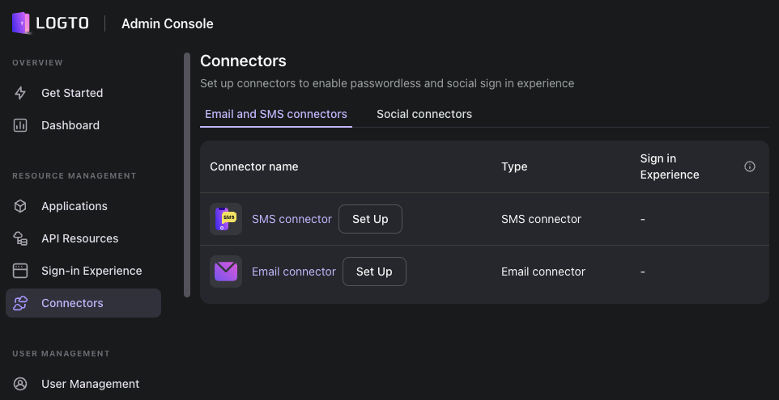

# Logto Application Deployment Guide
This guide will walk you through the process of deploying the Logto application using Docker Compose.



## Prerequisites
- Docker
- Docker Compose

## Deployment Steps

1. Clone the Logto repository to your local machine.

```
git clone https://github.com/racksync/logto-docker.git
```

2. Navigate to the root of the project directory then change necessary configurations in the `.env` file.

```
cp default.env .env
```

3. Run the following command to start the Logto application.

```
docker-compose up -d
```

4. Navigate to `http://ip-address:3001` to access the Logto application. 

## Conclusion
By following these steps, you should have successfully deployed the Logto application. More information about the Logto application can be found in the following links.

[Getting Started](https://docs.logto.io/docs/tutorials/get-started/)
---
[API Documentation](https://docs.logto.io/docs/recipes/interact-with-management-api/)

# Contact Us
## [RACKSYNC CO., LTD.](https://racksync.com)

บจก.แรคซิงค์ คือผู้เชี่ยวชาญด้าน Automation และ Smart Solutions / Software Development ทุกขนาด เรามีบริการให้คำปรึกษาตลอดจนวางระบบ ติดตั้งและมอนิเตอร์โดยผู้เชี่ยวชาญ นอกจากนี้เรายังเป็นบริษัทรับพัฒนา Software As A Service แบบครบวงจรอีกด้วย
\
\
RACKSYNC COMPANY LIMITED \
Suratthani, Thailand 84000 \
Email : devops@racksync.com \
Tel : +66 85 880 8885 